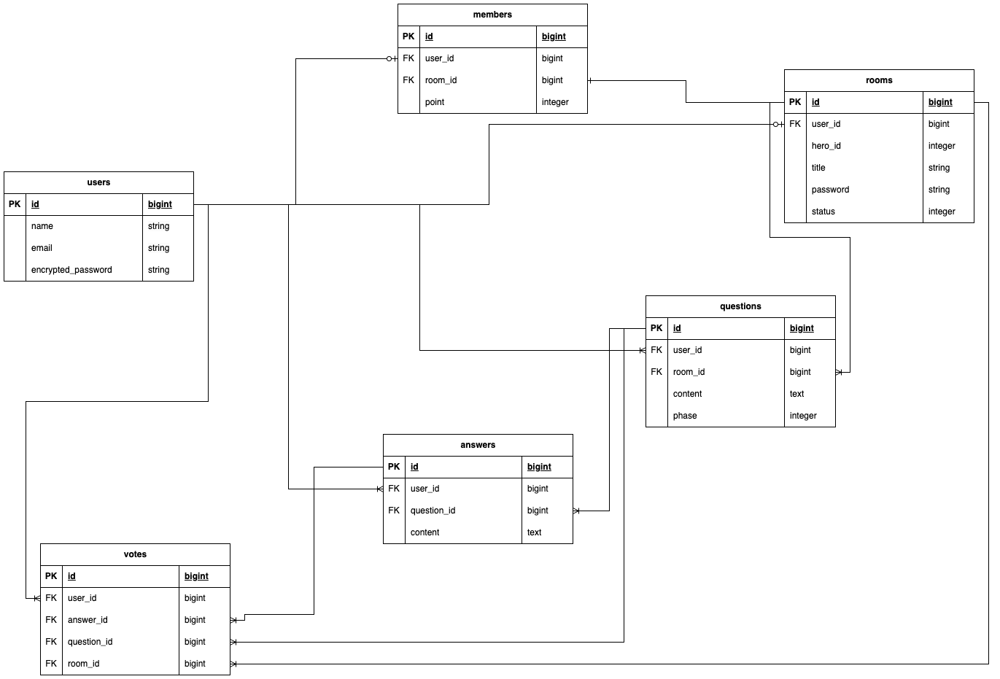

# なりきりクイズ

## サービス概要
お互いのことを知れるゲームサービス。
仲間内だけでなく、初対面同士でも楽しめる内容です。

## 想定されるユーザー層
オンラインで遊ぶ・集まることが多い人

## サービスコンセプト
手軽に盛り上がれるオンラインゲームを考案しました。
休日は友人とオンラインでゲームをしていることが多いのですが、
面白いゲームに限って対戦そのものやルールの把握に時間がかかるものが多いです。
オンライン飲み会の合間などに手軽にできて
初対面でも盛り上がれるゲームがあればいいなと思ってこのサービスを考えました。
ゲーム勝敗そのものよりもプロセスが楽しめるものになっていると思います。

## 実装を予定している機能
### MVP
* ユーザー登録機能
  * メールアドレス・パスワードを使ってログインできる
  * マイページから名前・メールアドレス・パスワードを編集できる
* ルーム作成機能
  * ログイン後のユーザーは、ルーム名・パスワードを指定してルームの作成ができる
  * ルーム作成者はルームの解散ができる
* ルーム参加機能
  * ログイン後のユーザーは、ルームID・パスワードを入力してルームへの参加ができる
  * 参加済みしたルームはルーム一覧から閲覧できる
  * ゲーム開始後のルームへの参加はできない
* ゲーム進行
  * ルーム作成者は、参加者の中から主役を決めゲームの開始ができる
  * ルーム作成者は、主役以外の参加者から出題者を決定できる
  * 出題者は問題を出題することができる。出題後、参加者全員の画面が回答画面に切り替わる
  * 出題を受けた参加者は回答することができる。回答人数はリアルタイムで変更・表示される
  * ルーム作成者は、回答を締め切って投票を開始することができる。回答締め切り後、参加者全員に投票画面が表示される
  * 投票画面では全ての回答が匿名で表示され、そのうちの自分の回答以外の1つに投票することができる。回答人数はリアルタイムで変更・表示される。
  * 主役の回答に投票すると最終結果に1点加算される。
  * ルーム作成者は、投票を締め切って結果を表示することができる。投票締め切り後、参加者全員に結果画面が表示される
  * 結果画面では各参加者の回答および得票数が表示される。
  * ルーム作成者は、次の出題者の決定またはゲームの終了を決めることができる。
  * ゲーム終了後、参加者ごとの総合得点が表示される。また、問題の回答および得票数も表示される。
  * 各ルームは常に最新の問題が表示される。（例：3問目までゲームが進行していれば、1問目のURLにアクセスしても3問目が表示される）

## 画面遷移図-figmaリンク
https://www.figma.com/file/KUW27R7RI8tRJljhyvDZx6/Mimic-Quiz-UI?type=design&node-id=0-1&mode=design&t=1Ypd3MbjXzE1RjZU-0

## ER図
